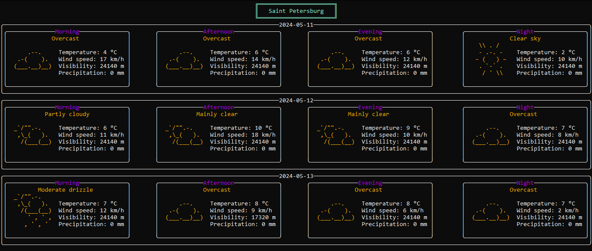

# Weather Forecast Application


A console application that displays the weather forecast for a selected list of cities, using third-party libraries.

## Data Source

- [Open-Meteo](https://open-meteo.com/en/docs#latitude=59.94&longitude=30.31&hourly=temperature_2m&forecast_days=16) for forecasts.
- [Api-Ninjas](https://api-ninjas.com/api/city) for obtaining coordinates based on city names.

## Functionality

- Displays weather forecast for several days ahead (default value is set in the config)
- Updates with a certain frequency (set in the config)
- Switches between cities using "n" and "p" keys
- Exits the program by pressing Esc
- Increases/decreases the number of forecast days by pressing the "+" and "-" keys

The list of cities, update frequency, and forecast days should be defined in the config (JSON).

## JSON Config Example

```json
{
  "cityNames": ["Saint Petersburg", "Moscow", "Berlin"],
  "refreshInterval": 1,
  "countDays": 4,
  "apiCode": "USER_API_CODE"
}
```


## Display


    
